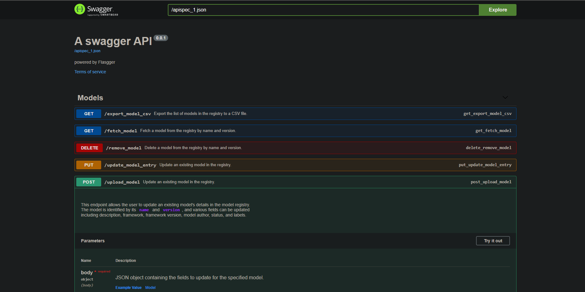
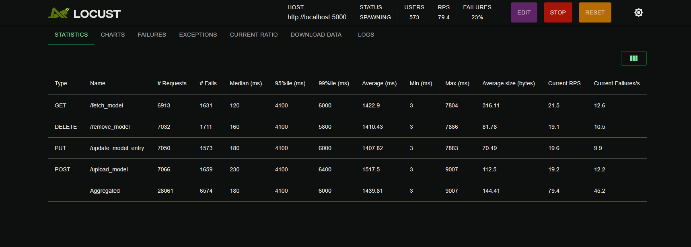
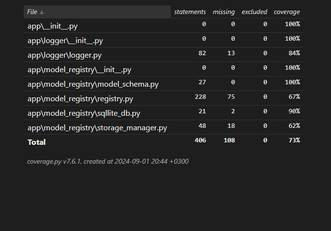
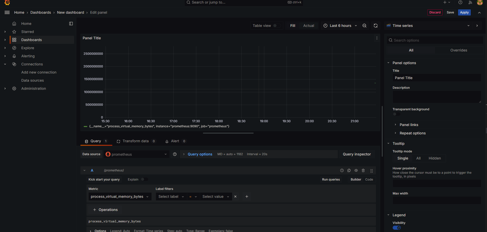

## Table of Contents

- [Introduction](#introduction)
- [Features](#features)
- [Installation](#installation)
  - [Docker Installation](#option-1-docker-installation)
  - [Manual Installation](#option-2-manual-installation)
- [Usage](#usage)
  - [Swagger UI](#swagger-ui)
  - [API Endpoints](#api-endpoints)
  - [Example API Requests](#example-api-requests)
- [Tests](#tests)
  - [Unit Tests](#1-unit-tests)
  - [Integration Tests](#2-integration-tests)
  - [Performance Tests with Locust](#3-performance-tests-with-locust)
  - [Test Coverage Report](#test-coverage-report)
- [Monitoring with Grafana and Prometheus](#monitoring-with-grafana-and-prometheus)

## Introduction

Machine learning model management is a critical aspect of deploying and maintaining robust AI solutions. A **Model Registry** serves as a centralized repository to manage the lifecycle of machine learning models, from experimentation to production deployment. This project provides a comprehensive Python-based solution for a Machine Learning Model Registry, designed to streamline the process of model tracking, versioning, and deployment, ensuring consistency, reproducibility, and reliability in machine learning workflows.

The **Machine Learning Model Registry** allows data scientists and machine learning engineers to:

- **Register** and store models with metadata, performance metrics, and artifacts.
- **Track** model versions to manage updates and maintain lineage.
- **Retrieve** models with simple APIs for seamless integration into various environments.
- **Deploy** models efficiently, ensuring scalability and robustness in production environments.

Whether you are building models from scratch or integrating pre-trained models, this registry simplifies the entire lifecycle, providing an organized and collaborative approach to managing machine learning models.


## Features

The **Machine Learning Model Registry** provides a robust and flexible solution for managing machine learning models throughout their lifecycle. Below are the key features of this project:

- **Model Registration and Management**: Add, update, fetch, and delete machine learning models and their metadata from a centralized SQLite database. The registry ensures that models are stored with all relevant information such as version, framework, author, hyperparameters, evaluation metrics, and more.

- **Cloud Integration with Google Cloud Storage**: Seamlessly upload and download model files to and from Google Cloud Storage. This feature ensures that models are not only stored locally but are also backed up and accessible via the cloud for better scalability and collaboration.

- **Comprehensive Metadata Handling**: Manage extensive model metadata, including descriptions, framework details, hyperparameters, evaluation metrics, training data sources, and model authors. This feature helps maintain a complete history and context for every model in the registry.

- **Version Control**: Track different versions of the same model to maintain a detailed lineage and history of model updates, ensuring consistency and reproducibility in experiments and deployments.

- **Label Management**: Assign and manage labels (tags) for models, making it easy to categorize and search for models based on specific characteristics or use cases.

- **Model Retrieval and Validation**: Retrieve models and their metadata using simple API calls. The retrieval process includes optional model validation to ensure the data integrity and consistency of stored models.

- **Data Export to CSV**: Export the entire registry data to a CSV file for reporting, auditing, or further analysis.

- **Custom SQL Query Management**: Load and manage SQL queries dynamically from external SQL files, allowing for flexible database operations without hardcoding SQL commands in the codebase.

- **Context Management with Python's `with` Statement**: Leverage Python's context management (`with` statement) for efficient database connection handling, ensuring that connections are properly opened and closed, and minimizing the risk of resource leaks.

- **Error Handling and Logging**: Built-in error handling and logging using a custom logger (`ColorLogger`) to provide clear and colored log messages for different operations, including database transactions, cloud storage interactions, and registry updates.

- **Testing Suite**:
  - **Unit Tests**: Ensure individual components and functionalities work as expected.
  - **Integration Tests**: Validate the interaction between different parts of the application.
  - **Locust Tests**: Perform load testing to evaluate system performance under stress.

- **Dockerized Deployment**: The entire application is Dockerized, allowing for easy setup and deployment. Docker containers ensure consistency across different environments and simplify dependency management, making the model registry highly portable and scalable.

These features make the **Machine Learning Model Registry** a powerful tool for managing models in production environments, facilitating better collaboration, traceability, and operational efficiency.

## Installation

You can set up the **Machine Learning Model Registry** using Docker for a quick and consistent deployment or install it manually by setting up the Python environment and running the application. Follow the instructions below for your preferred method.

### Option 1: Docker Installation

The easiest way to get started with the **Model Registry** is by using Docker. Docker ensures a consistent environment and simplifies dependency management.

1. Make sure you have [Docker](https://docs.docker.com/get-docker/) and [Docker Compose](https://docs.docker.com/compose/install/) installed on your machine.

2. Clone this repository to your local machine:

   ```bash
   https://github.com/AdnanEkici/CustomMLRegistry.git
   cd CustomMLRegistry
   ```

3. Run the following command to build and start the application in detached mode:

   ```bash
   docker compose -f docker-compose-registry.yml up -d
   ```

4. The application will be up and running in a Docker container. You can check the status using:

   ```bash
   docker ps
   ```

5. To stop the Docker containers, run:

   ```bash
   docker compose -f docker-compose-registry.yml down
   ```

### Option 2: Manual Installation

If you prefer not to use Docker, you can manually set up the environment and run the application.

1. Make sure you have Python 3.10+ installed on your machine. You can check the version by running:

   ```bash
   python --version
   ```

2. Clone this repository to your local machine

   ```bash
   git clone https://github.com/AdnanEkici/CustomMLRegistry.git
   cd CustomMLRegistry
   ```
3. Install the required Python packages:

   ```bash
   pip install -r requirements.txt
   ```
4. Run the application using the following command:

   ```bash
   python app/model_registry/endpoint.py
   ```

5. The application should now be running, and you can interact with the model registry via the provided API endpoints.

Choose the installation method that best suits your environment and workflow. For most users, Docker provides a hassle-free setup, while manual installation gives more control over the environment.

Note: If you run model registry in vscode. There are several tasks that helps user to speed up to running process.

1. If you want to run in debug mode simply press f5.

2. You can start docker compose with pressing ctrl + shift + p then select Tasks: Run Task with this you can easyly start registry or locust endpoint test.


## Usage

Once the **Machine Learning Model Registry** is installed and running, you can use it to manage machine learning models by performing operations such as adding, updating, retrieving, and deleting models. The registry provides a set of API endpoints that you can interact with using tools like `curl`, `Postman`, or any HTTP client library.

### Swagger UI

The **Model Registry** comes with integrated Swagger documentation, which provides an interactive UI for exploring and testing API endpoints.

1. **Accessing Swagger UI**: After starting the application, open your web browser and navigate to:

  ```bash
  http://localhost:5000/apidocs
  ```



### API Endpoints

Below are some of the core API endpoints available in the Model Registry:

- **Add a Model**: Register a new machine learning model with metadata and optional labels.
  ```bash
  POST /models/add
  ```
This will open the Swagger UI, where you can view all available endpoints, their parameters, and example responses. You can also execute the endpoints directly from the Swagger interface.

- **Update a Model**: Update metadata or labels for an existing model.
  ```bash
  PUT /models/update
  ```

- **Fetch a Model**: Retrieve metadata and labels of a model by its name and version. Optionally, download the model file from cloud storage.
  ```bash
  GET /models/fetch
  ```

- **Delete a Model**: Remove a model from the registry and optionally from cloud storage.
  ```bash
  DELETE /models/delete
  ```

- **Export Models to CSV**: Export all registered models and their metadata to a CSV file.
  ```bash
  POST /models/add
  ```

## Example API requests.

Upload a model example curl.

```bash
curl --location 'http://127.0.0.1:5000/upload_model' \
--header 'Content-Type: application/json' \
--data '{
  "name": "RandomForestClassifier",
  "version": "1.0",
  "file_path": "Downloads/random_forest_model.pkl",
  "description": "Random Forest model for classifying customer segments",
  "framework": "scikit-learn",
  "framework_version": "0.24.1",
  "training_data": "Customer segmentation dataset",
  "hyperparameters": "{\"n_estimators\": 100, \"max_depth\": 5}",
  "evaluation_metrics": "{\"accuracy\": 0.87, \"f1_score\": 0.82}",
  "model_author": "John Smith",
  "status": "under review",
  "labels": ["classification", "customer-segmentation", "scikit-learn", "random-forest"]
}'
```

Upload a model example postman body.

```bash
{
  "name": "RandomForestClassifier",
  "version": "1.0",
  "file_path": "Downloads/random_forest_model.pkl",
  "description": "Random Forest model for classifying customer segments",
  "framework": "scikit-learn",
  "framework_version": "0.24.1",
  "training_data": "Customer segmentation dataset",
  "hyperparameters": "{\"n_estimators\": 100, \"max_depth\": 5}",
  "evaluation_metrics": "{\"accuracy\": 0.87, \"f1_score\": 0.82}",
  "model_author": "John Smith",
  "status": "under review",
  "labels": ["classification", "customer-segmentation", "scikit-learn", "random-forest"]
}
```

Fetch a model example curl.
```bash
curl --location --request GET 'http://127.0.0.1:5000/fetch_model' \
--header 'Content-Type: application/json' \
--data '{
  "name": "RandomForestClassifier",
  "version": "1.0"
}'
```
Fetch a model example postman body.
```bash
{
  "name": "RandomForestClassifier",
  "version": "1.0"
}
```

Update a model example curl.
```bash
curl --location --request PUT 'http://127.0.0.1:5000/update_model_entry' \
--header 'Content-Type: application/json' \
--data '{
    "name": "RandomForestClassifier",
    "version": "1.0",
    "framework_version": "0.24.2",
    "model_author": "Adnan",
    "labels": ["test"]
}'
```
Update a model example postman body.
```bash
{
    "name": "RandomForestClassifier",
    "version": "1.0",
    "framework_version": "0.24.2",
    "model_author": "Adnan",
    "labels": ["test"]
}
```


Delete a model example curl.
```bash
curl --location --request DELETE 'http://127.0.0.1:5000/remove_model' \
--header 'Content-Type: application/json' \
--data '{
  "name": "RandomForestClassifier",
  "version": "1.0"
}'
```

Delete a model example postman body.
```bash
{
  "name": "RandomForestClassifier",
  "version": "1.0"
}
```


Export registry example curl.
```bash
curl --location 'http://127.0.0.1:5000/export_model_csv'
```
Export registry example postman body.
```bash
{}
```

## Tests

This project includes a comprehensive testing suite to ensure the reliability, stability, and scalability of the **ADO-FLOW: Machine Learning Model Registry**. The testing suite consists of **unit tests**, **integration tests**, and **Locust tests** for performance testing.

### 1. Unit Tests

Unit tests are designed to test individual components and functions of the application to ensure they work as expected.

#### Running Unit Tests

To run the unit tests, you can use `pytest`. Make sure you have `pytest` installed:

2. Integration Tests
Integration tests validate the interactions between different parts of the application to ensure they work together correctly.

Running Integration Tests
To run the integration tests, use pytest in a similar manner as for unit tests:

Both tests will be run.
```bash
pip install pytest
python -m unittest
```


3. Performance Tests with Locust
Locust is used for load testing to evaluate the system's performance under different levels of traffic and usage.

* Make sure you have Docker and Docker Compose installed on your machine.

* Run the following command to start Locust in detached mode:

```bash
docker compose -f docker-compose-locust-test.yml up -d
```

* Open your web browser and navigate to http://localhost:8089/ to access the Locust web UI.

* Set the number of users to simulate and the hatch rate (users per second) in the UI, and then start the test.

* Monitor the performance metrics such as response times, requests per second, and failure rates to evaluate the system's performance.



4. Test Coverage Report
To generate a test coverage report, use the pytest-cov plugin. Install it if you haven't already:

```bash
pytest --cov=app --cov-report=html tests/
```



### Monitoring with Grafana and Prometheus

**Grafana** and **Prometheus** are integrated for monitoring the system's performance during load testing and for providing visual insights into various metrics.

#### Setting Up Grafana and Prometheus

1. Make sure you have Docker and Docker Compose installed.

2. When app is up and running with docker graphana and prometheus will be up.

3. Access the Grafana dashboard at http://localhost:3000/.

4. Log in using the default credentials (admin/admin), and you can add Prometheus as a data source.

5. Access the Prometheus UI at http://localhost:9090/ to query and monitor metrics directly.

6. Use the pre-configured Grafana dashboards or create your own to visualize performance metrics such as CPU usage, memory consumption, and request throughput.

#### NOTE !

YOU HAVE TO ADD YOUR GOOGLE DRIVE KEY TO app\model_registry\storage_manager.py


